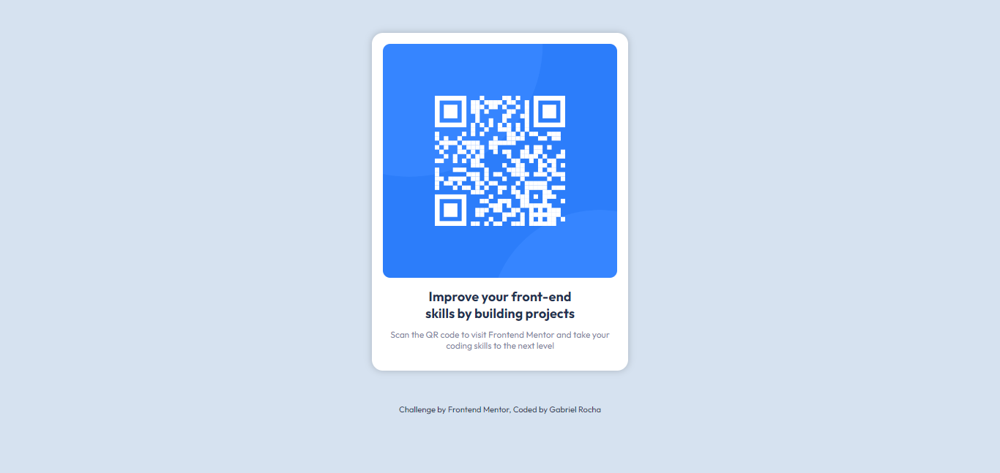

# Frontend Mentor - QR code component solution

This is a solution to the [QR code component challenge on Frontend Mentor](https://www.frontendmentor.io/challenges/qr-code-component-iux_sIO_H). Frontend Mentor challenges help you improve your coding skills by building realistic projects. 

## Table of contents

- [Overview](#overview)
  - [Screenshot](#screenshot)
  - [Links](#links)
- [My process](#my-process)
  - [Built with](#built-with)
  - [What I learned](#what-i-learned)
  - [Continued development](#continued-development)
  - [Useful resources](#useful-resources)
- [Author](#author)
- [Acknowledgments](#acknowledgments)

## Overview

### Screenshot

### Links

- Live Site URL: [QR code component](https://devgabrielrocha.github.io/project-qr-code-component-main/qr-code-component-main/index.html)

## My process

### Built with

- Semantic HTML5 markup
- CSS custom properties
- Mobile-first workflow
- Font import from google fonts

### What I learned

This is my first project on the mentor frontend, I haven't made a project with just a few instructions yet. I really liked it because I could practice my knowledge in semantic HTML5, css custom properties, and GIT and GITHUB.

### Continued development

I will study more about Sass, I saw the recommendation in the instructions, but I don't know much about it yet.

### Useful resources

- [Attekita Dev](https://youtu.be/xFtquKPf7Ug) - I found out about Frontend Mentor through Attekita Dev.
- [Curso em vídeo](https://www.cursoemvideo.com/) - I applied the knowledge of the HTML 5 and CSS.

## Author

- Github - [@DevGabrielRocha](https://github.com/DevGabrielRocha)
- Frontend Mentor - [@DevGabrielRocha](https://www.frontendmentor.io/profile/DevGabrielRocha)
- LinkedIn - [Gabriel Rocha](https://www.linkedin.com/in/gabrielrochaleite/)

## Acknowledgments

I leave here my thanks to [Attekita Dev](https://www.youtube.com/@attekitadev) for having created the video about. And to Gustavo Guanabara from [Curso em Vídeo](https://www.cursoemvideo.com/) for undoubtedly being one of the greatest programming teachers in Brazil.
